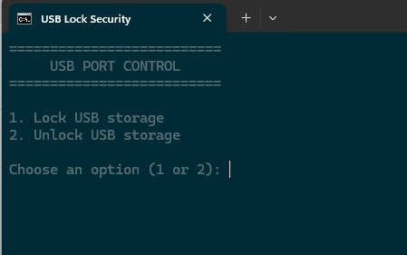

# Contrôle du stockage USB

Ce projet contient `usb_control.bat`, un lanceur qui ouvre une interface
graphique Windows. L’interface et la logique de contrôle sont dans
`src/usb_control.ps1`.

## Structure du projet

```text
usb_control.bat                 Lanceur Windows
src/usb_control.ps1             Point d’entrée et assemblage de l’interface
src/Modules/Actions.ps1          Opérations USB et confirmations
src/Modules/Dialogs.ps1          Fenêtres, saisie masquée et boutons
src/Modules/Storage.ps1          Registre, disques USB et journal
assets/                          Images de l’application et documentation
data/                            Journal et sauvegarde locale du Registre
.gitignore                       Exclut les données locales générées
README.md                        Documentation
```

Le script principal charge les modules de `src/Modules/` au démarrage.

## Développement

Dans VS Code, installez l’extension **PowerShell** de Microsoft (`ms-vscode.powershell`).
Le projet sélectionne son formateur PowerShell, applique le style OTBS et formate
les fichiers `.ps1` en UTF-8 avec BOM à l’enregistrement pour préserver les accents
dans Windows PowerShell 5.1. Vous pouvez aussi lancer **Format Document** depuis la
palette de commandes.

## Aperçu



La photo d’arrière-plan de l’application est `assets/usb-control-background.jpg`.

## Utilisation

1. Créez la variable d’environnement Windows `USB_CONTROL_PASSWORD` pour votre
   compte et définissez le mot de passe de votre choix.
2. Fermez puis rouvrez votre terminal ou votre session Windows pour que la
   variable soit prise en compte.
3. Lancez `usb_control.bat`. Windows demandera automatiquement l’autorisation
   d’administrateur via l’UAC. Seule l’interface administrateur reste ouverte.
4. Consultez l’état du stockage USB et la liste des disques connectés, avec leur
   modèle, capacité et lettre de lecteur. Utilisez **Actualiser** pour relire
   l’état et la liste, ou les boutons pour verrouiller, déverrouiller, restaurer
   la valeur initiale, ouvrir le journal ou quitter.
   Le bouton de restauration reste désactivé tant que la sauvegarde initiale
   n’existe pas et affiche sa valeur lorsqu’elle est disponible.
5. Saisissez le mot de passe dans la boîte de dialogue. La saisie est masquée.
6. Vérifiez le récapitulatif et confirmez les modifications du Registre.

Le script modifie la valeur `Start` du service Windows `USBSTOR`, puis vérifie
que la modification a bien été appliquée. Si le stockage est déjà dans l’état
demandé, le Registre n’est pas réécrit.

Les disques USB déjà connectés peuvent rester accessibles après le verrouillage.
Le script affiche un avertissement et demande confirmation avant de continuer.

Avant le premier verrouillage ou déverrouillage, la valeur initiale de `Start`
est enregistrée dans `data/usb_control.previous`. Le fichier est marqué en
lecture seule afin d’éviter une modification accidentelle. L’option de
restauration remet cette valeur.

Le journal des opérations est enregistré dans `data/usb_control.log`. Il indique
la date, l’action et le résultat, sans jamais contenir le mot de passe.

## Remarques

- Le verrouillage concerne les périphériques de stockage USB ; les autres
  périphériques USB, comme les claviers et les souris, peuvent continuer à
  fonctionner.
- Le mot de passe n’est pas enregistré dans les fichiers du projet. La variable
  d’environnement reste accessible à votre compte Windows et ne protège pas
  contre une personne ayant accès à cette session.
- Les images de l’application sont rangées dans `assets/`.
